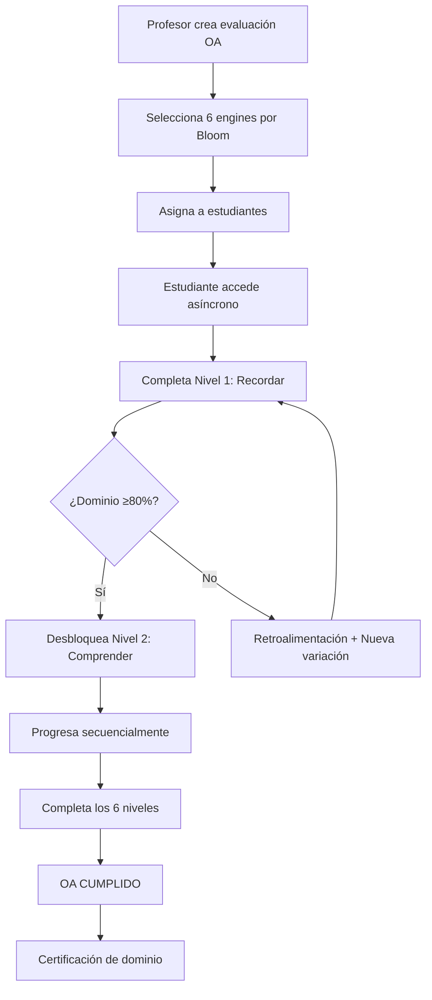

# DOCUMENTACIÓN COMPLETA DEL PROYECTO EDU21

## RESUMEN EJECUTIVO

**EDU21** es una plataforma educativa chilena especializada en **evaluaciones gamificadas** que implementa la **taxonomía de Bloom** para crear experiencias de aprendizaje asíncrono efectivas y didácticas, alineadas con el currículum MINEDUC.

### Propósito Principal
Crear **evaluaciones gamificadas** por cada **Objetivo de Aprendizaje (OA)** y asignatura, con **6 actividades específicas** para cada nivel de la taxonomía de Bloom, permitiendo un aprendizaje asíncrono donde los estudiantes deben alcanzar un **dominio del 80%** para considerar cumplido el objetivo.

## 1. ARQUITECTURA DEL SISTEMA

### 1.1 Arquitectura General
```
┌─────────────────┐    ┌─────────────────┐    ┌─────────────────┐
│   FRONTEND      │    │    BACKEND      │    │   DATABASE      │
│   Next.js       │◄──►│   Express.js    │◄──►│   Supabase      │
│   React + TS    │    │   Node.js       │    │   PostgreSQL    │
└─────────────────┘    └─────────────────┘    └─────────────────┘
         │                       │                       │
         └───────────────────────┼───────────────────────┘
                                 │
                    ┌─────────────────┐
                    │   EVALUACIONES   │
                    │   GAMIFICADAS    │
                    │   - 6 Engines   │
                    │   - Bloom Levels│
                    │   - OA Mapping  │
                    └─────────────────┘
```

### 1.2 Stack Tecnológico

**Frontend:**
- Next.js 13+ (App Router)
- React 18
- TypeScript
- TailwindCSS
- Zustand (Estado global)

**Backend:**
- Express.js
- Node.js
- Socket.io (Tiempo real)
- Middleware RBAC

**Base de Datos:**
- Supabase (PostgreSQL)
- Row Level Security (RLS)
- Real-time subscriptions

**Integración IA:**
- OpenAI GPT-4 (Generación de preguntas)
- Text-to-Speech (TTS)
- Análisis de respuestas

## 2. SISTEMA DE EVALUACIONES GAMIFICADAS

### 2.1 Estructura por Taxonomía de Bloom

Para cada **Objetivo de Aprendizaje (OA)**, se diseñan **6 actividades gamificadas** correspondientes a cada nivel de Bloom:

```
OA (Ej: 1° Básico - OA1 Matemáticas)
├── 1. RECORDAR - Reconocimiento de números (Engine ENG01)
├── 2. COMPRENDER - Comparación de cantidades (Engine ENG02)
├── 3. APLICAR - Suma básica en contexto (Engine ENG05)
├── 4. ANALIZAR - Descomposición numérica (Engine ENG06)
├── 5. EVALUAR - Validar estrategias de conteo (Engine ENG07)
└── 6. CREAR - Inventar problemas numéricos (Engine ENG09)
```

### 2.2 Engines de Evaluación

#### ENG01: Reconocimiento y Conteo (RECORDAR)
- **Propósito:** Identificar números y contar elementos
- **Mecánica:** Drag & drop, selección múltiple
- **Ejemplo:** Contar animales en una granja

#### ENG02: Comparación Numérica (COMPRENDER)
- **Propósito:** Comparar cantidades y ordenar
- **Mecánica:** Ordenamiento visual, mayor/menor
- **Ejemplo:** Ordenar grupos de objetos

#### ENG05: Aplicación Contextual (APLICAR)
- **Propósito:** Usar conocimientos en situaciones nuevas
- **Mecánica:** Resolución de problemas interactivos
- **Ejemplo:** Repartir objetos equitativamente

#### ENG06: Análisis de Patrones (ANALIZAR)
- **Propósito:** Descomponer elementos y encontrar patrones
- **Mecánica:** Construcción paso a paso
- **Ejemplo:** Identificar secuencias numéricas

#### ENG07: Evaluación de Estrategias (EVALUAR)
- **Propósito:** Validar métodos y tomar decisiones
- **Mecánica:** Selección de mejores opciones
- **Ejemplo:** Elegir estrategia de conteo más eficiente

#### ENG09: Creación Original (CREAR)
- **Propósito:** Inventar soluciones y productos originales
- **Mecánica:** Construcción libre con restricciones
- **Ejemplo:** Crear problemas matemáticos propios

### 2.3 Sistema de Dominio (80%)

```javascript
// Criterio de dominio por nivel de Bloom
const criteriosDominio = {
  recordar: { umbral: 80, intentosMax: 3 },
  comprender: { umbral: 80, intentosMax: 4 },
  aplicar: { umbral: 80, intentosMax: 5 },
  analizar: { umbral: 80, intentosMax: 4 },
  evaluar: { umbral: 80, intentosMax: 3 },
  crear: { umbral: 80, intentosMax: 2 }
};
```

**Lógica de Progreso:**
1. Estudiante completa actividad gamificada
2. Sistema calcula porcentaje de dominio
3. Si ≥80%: Nivel desbloqueado → Siguiente nivel de Bloom
4. Si <80%: Retroalimentación → Repite con variaciones
5. Al completar los 6 niveles: OA CUMPLIDO

## 3. BASE DE DATOS DE PREGUNTAS

### 3.1 Estructura de Preguntas

```sql
-- Tabla principal de preguntas
CREATE TABLE question_bank (
    id SERIAL PRIMARY KEY,
    oa_code VARCHAR(20) NOT NULL,           -- Ej: "1B-MAT-OA1"
    asignatura VARCHAR(50) NOT NULL,        -- Matemáticas, Lenguaje, etc.
    curso VARCHAR(20) NOT NULL,             -- "1° Básico"
    bloom_level bloom_level_enum NOT NULL,  -- recordar, comprender, etc.
    engine_type VARCHAR(10) NOT NULL,       -- ENG01, ENG02, etc.
    question_content JSONB NOT NULL,        -- Contenido adaptativo
    difficulty_level INTEGER DEFAULT 1,     -- 1-5
    is_ai_generated BOOLEAN DEFAULT false,
    created_at TIMESTAMP DEFAULT NOW()
);

-- Tipos de nivel de Bloom
CREATE TYPE bloom_level_enum AS ENUM (
    'recordar',
    'comprender', 
    'aplicar',
    'analizar',
    'evaluar',
    'crear'
);
```

### 3.2 Ejemplo de Pregunta Estructurada

```json
{
  "oa_code": "1B-MAT-OA1",
  "asignatura": "Matemáticas",
  "curso": "1° Básico",
  "bloom_level": "recordar",
  "engine_type": "ENG01",
  "question_content": {
    "enunciado": "Cuenta los pollitos en la granja",
    "elementos": [
      { "tipo": "pollito", "cantidad": 5, "posicion": "scattered" }
    ],
    "respuesta_correcta": 5,
    "opciones": [3, 4, 5, 6],
    "feedback": {
      "correcto": "¡Excelente! Contaste correctamente los 5 pollitos",
      "incorrecto": "Intenta contar nuevamente, toca cada pollito"
    },
    "ayuda": "Toca cada pollito mientras cuentas: 1, 2, 3..."
  }
}
```

## 4. SISTEMA DE ROLES Y PERMISOS

### 4.1 Roles Educativos

#### TEACHER (Profesor)
```javascript
permisos: [
  'crear_evaluaciones_oa',      // Crear evaluaciones por OA
  'asignar_evaluaciones',       // Asignar a estudiantes
  'ver_progreso_bloom',         // Ver progreso por niveles de Bloom
  'generar_reportes_dominio',   // Reportes de dominio 80%
  'ajustar_dificultad',         // Personalizar dificultad
  'retroalimentacion_tiempo_real'
]
```

#### STUDENT (Estudiante)
```javascript
permisos: [
  'acceder_evaluaciones_asignadas',  // Solo evaluaciones asignadas
  'completar_niveles_bloom',         // Progreso secuencial Bloom
  'ver_progreso_personal',           // Dashboard personal
  'usar_modo_asincrono',             // Aula + casa
  'recibir_retroalimentacion'
]
```

#### GUARDIAN (Apoderado)
```javascript
permisos: [
  'ver_progreso_oa_estudiante',      // Progreso por OA
  'ver_dominio_por_bloom',           // Nivel de dominio alcanzado
  'recibir_notificaciones_logros',   // 80% completado
  'acceder_recomendaciones_apoyo'
]
```

### 4.2 Workflow de Evaluación



## 5. IMPLEMENTACIÓN ASÍNCRONA

### 5.1 Arquitectura Asíncrona

**Sincronización de Progreso:**
```javascript
// Cliente (aula/casa)
const guardarProgreso = async (progresoLocal) => {
  try {
    await api.post('/evaluaciones/progreso', {
      estudiante_id: session.user.id,
      oa_code: evaluacion.oa_code,
      bloom_level: nivelActual,
      porcentaje_dominio: progreso.porcentaje,
      tiempo_dedicado: progreso.tiempo,
      intentos: progreso.intentos,
      offline_data: progresoLocal
    });
  } catch (error) {
    // Guarda localmente si no hay conexión
    localStorage.setItem('progreso_pendiente', JSON.stringify(progresoLocal));
  }
};
```

### 5.2 Persistencia Offline

```javascript
// Service Worker para modo offline
const evaluacionesCache = {
  async guardarEvaluacion(oa_code, datos) {
    const cache = await caches.open('edu21-evaluaciones');
    await cache.put(`/evaluacion/${oa_code}`, new Response(JSON.stringify(datos)));
  },
  
  async sincronizarAlConectar() {
    const progresosPendientes = localStorage.getItem('progreso_pendiente');
    if (progresosPendientes && navigator.onLine) {
      await enviarProgresoPendiente(JSON.parse(progresosPendientes));
      localStorage.removeItem('progreso_pendiente');
    }
  }
};
```

## 6. MÉTRICAS Y ANALÍTICAS

### 6.1 Dashboard de Dominio

**Para Profesores:**
```
┌─────────────────────────────────────┐
│     DOMINIO POR NIVELES DE BLOOM    │
├─────────────────────────────────────┤
│ OA1 - Números hasta 20              │
│ ├── Recordar:    ████████████ 85%   │
│ ├── Comprender:  ████████░░░░ 72%   │
│ ├── Aplicar:     ██████░░░░░░ 58%   │
│ ├── Analizar:    ████░░░░░░░░ 41%   │
│ ├── Evaluar:     ██░░░░░░░░░░ 23%   │
│ └── Crear:       ░░░░░░░░░░░░  0%   │
└─────────────────────────────────────┘
```

### 6.2 Indicadores de Progreso

```javascript
const indicadores = {
  dominio_oa: 'Porcentaje de OA con 80%+ de dominio',
  tiempo_promedio_nivel: 'Tiempo promedio por nivel de Bloom',
  intentos_hasta_dominio: 'Intentos necesarios para alcanzar 80%',
  patron_dificultades: 'Niveles de Bloom con mayor dificultad',
  progreso_asincrono: 'Balance aula vs casa',
  engagement_engine: 'Engines más efectivos por estudiante'
};
```

## 7. EXTENSIBILIDAD

### 7.1 Agregar Nuevo OA

```javascript
// Estructura para nuevo OA
const nuevoOA = {
  codigo: "2B-CIE-OA3",
  asignatura: "Ciencias Naturales",
  curso: "2° Básico",
  titulo: "Estados de la materia",
  
  // Mapeo de engines por nivel de Bloom
  engines_bloom: {
    recordar: "ENG01",     // Identificar estados
    comprender: "ENG02",   // Clasificar ejemplos
    aplicar: "ENG05",      // Predecir cambios
    analizar: "ENG06",     // Comparar propiedades
    evaluar: "ENG07",      // Evaluar experimentos
    crear: "ENG09"         // Diseñar experimento
  },
  
  // Criterios de dominio específicos
  criterios_dominio: {
    umbral_base: 80,
    adaptaciones_especiales: true
  }
};
```

### 7.2 Crear Nuevo Engine

```javascript
// Template para nuevo engine
const EngineTemplate = {
  id: "ENG10",
  nombre: "Simulación Interactiva",
  bloom_levels: ["aplicar", "analizar", "crear"],
  
  configuracion: {
    tipo_interaccion: "simulation",
    elementos_ui: ["canvas", "controls", "feedback"],
    metricas: ["precision", "tiempo", "estrategia"]
  },
  
  renderizar: (pregunta, estudiante) => {
    // Lógica específica del engine
  },
  
  evaluar: (respuesta, criterios) => {
    // Algoritmo de evaluación
  }
};
```

## 8. ESTADO ACTUAL Y ROADMAP

### 8.1 Estado Actual (Q1 2024)

**✅ Completado:**
- ✅ Arquitectura base (Frontend + Backend + DB)
- ✅ Sistema de roles RBAC
- ✅ 6 engines básicos implementados
- ✅ Base de datos de preguntas estructurada
- ✅ Integración OpenAI para generación

**🔄 En Desarrollo:**
- 🔄 Métricas de dominio 80%
- 🔄 Sistema de progreso por Bloom
- 🔄 Evaluaciones asíncronas completas

**⏳ Pendiente:**
- ⏳ OA completos para 1° Básico
- ⏳ Dashboard analítico avanzado
- ⏳ Modo offline robusto

### 8.2 Roadmap de Desarrollo

**Fase 1 (2-3 meses): Consolidación**
- Completar OA1-OA5 de 1° Básico Matemáticas
- Implementar sistema de dominio 80%
- Dashboard de progreso por Bloom
- Testing con usuarios reales

**Fase 2 (3-6 meses): Expansión**
- Agregar Lenguaje 1° Básico
- Engines especializados por asignatura
- Sistema de recomendaciones adaptativas
- Modo offline completo

**Fase 3 (6-12 meses): Escalamiento**
- Expansión a 2° Básico
- Analíticas predictivas
- Integración LMS externos
- Certificaciones de dominio

## 9. CONSIDERACIONES TÉCNICAS

### 9.1 Performance
- **Carga asíncrona:** Evaluaciones se precargan para uso offline
- **Optimización mobile:** Designed-first para tablets educativos
- **Caching inteligente:** Preguntas frecuentes en cache local

### 9.2 Seguridad
- **RLS Supabase:** Acceso por contexto educativo
- **Encriptación:** Progreso estudiantil encriptado
- **Auditoría:** Logs de acceso y modificaciones

### 9.3 Escalabilidad
- **Horizontal:** Múltiples escuelas simultáneas
- **Vertical:** Miles de estudiantes por escuela
- **Regional:** Adaptación curricular por región

## 10. CONCLUSIONES

EDU21 representa una plataforma educativa nueva generación que combina:

1. **Rigor pedagógico:** Taxonomía de Bloom aplicada sistemáticamente
2. **Tecnología moderna:** Stack escalable y mantenible
3. **Flexibilidad de uso:** Asíncrono aula/casa
4. **Métricas objetivas:** Dominio 80% como criterio claro
5. **Adaptabilidad:** Engines especializados por tipo de aprendizaje

La plataforma está diseñada para **transformar la evaluación tradicional** en **experiencias gamificadas de aprendizaje** que respetan los ritmos individuales mientras mantienen estándares de dominio altos.

**Próximo paso crítico:** Validación en aula real con 1° Básico para refinamiento del sistema de dominio y optimización de engines por nivel de Bloom. 